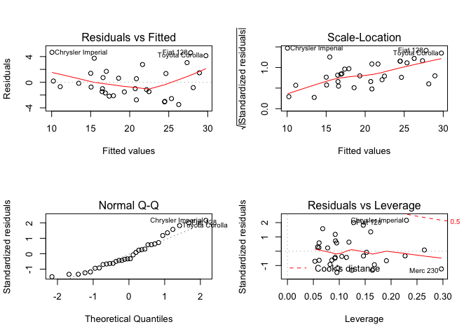
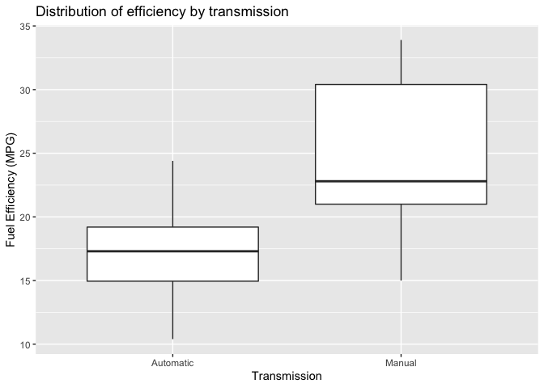

### Excecutive summary
This study will explore efficiency of automatic and manual transmission cars and quantify the difference if any. We will utilize the built in R data set "mtcars" which includes efficiency data in miles per gallon (MPG). We will attempt to answer the questions “Is an automatic or manual transmission better for MPG” and "Quantify the MPG difference between automatic and manual transmissions"

### Load data
First we will load any nescessary libraries. Because mtcars is a built in data set, we don't need to load in the data to R.

```r
library(dplyr)
library(ggplot2)
```

### Explore data
Let's take a look at our data set with a few basic functions - head() and str(). Looking at figure 1 (see appendix) we have 32 observations of 11 variables. Let's take a quick look at the mpg data plotted for both transmission types in figure 2.

Based on the plot figure in figure 2, we can see that on average manual transmission cars have higher fuel efficiency (e.g. higher MPG value). Let's run a T Test as we have a total of 32 samples to confirm if this difference is significant.

Figure 3

```r
t.test(mtcars$mpg[mtcars$am==1],mtcars$mpg[mtcars$am==0])
```

```
## 
## 	Welch Two Sample t-test
## 
## data:  mtcars$mpg[mtcars$am == 1] and mtcars$mpg[mtcars$am == 0]
## t = 3.7671, df = 18.332, p-value = 0.001374
## alternative hypothesis: true difference in means is not equal to 0
## 95 percent confidence interval:
##   3.209684 11.280194
## sample estimates:
## mean of x mean of y 
##  24.39231  17.14737
```

We can see that in figure 3, 0 is not included in the 95% sample and the p-value at 0.001 (rounded to 3 decimal places) which is much lower than 0.05, however we will need to also find out if we have any confounding variables that are contributing to this difference. For example, if most manual transmission cars are lower weight and most automatic cars are heavier, then weight could be the actual cause rather than transmission.

### Modelling
Now that we have a good idea of what our data looks like, let's try to create a model that will be able to help us understand the relationship between transmission and fuel efficiency. First let's look at a simple linear model with MPG as the outcome and transmission as the predictor.

Figure 4

```r
fit0 <- lm(mpg~factor(am),mtcars)
summary(fit0)
```

```
## 
## Call:
## lm(formula = mpg ~ factor(am), data = mtcars)
## 
## Residuals:
##     Min      1Q  Median      3Q     Max 
## -9.3923 -3.0923 -0.2974  3.2439  9.5077 
## 
## Coefficients:
##             Estimate Std. Error t value Pr(>|t|)    
## (Intercept)   17.147      1.125  15.247 1.13e-15 ***
## factor(am)1    7.245      1.764   4.106 0.000285 ***
## ---
## Signif. codes:  0 '***' 0.001 '**' 0.01 '*' 0.05 '.' 0.1 ' ' 1
## 
## Residual standard error: 4.902 on 30 degrees of freedom
## Multiple R-squared:  0.3598,	Adjusted R-squared:  0.3385 
## F-statistic: 16.86 on 1 and 30 DF,  p-value: 0.000285
```

Looking at the R-squared value of 0.360 in figure 4, this shows that our model accounts for approximately 36.0% of the variation. Let's add the other variables which we have in the mtcars data set and use the anova function to determine the best model.

Figure 5

```r
fit1 <- lm(mpg ~ factor(am), mtcars) 
fit2 <- lm(mpg ~ factor(am) + wt, mtcars) 
fit3 <- lm(mpg ~ factor(am) + wt + qsec, mtcars) 
fit4 <- lm(mpg ~ factor(am) + wt + qsec + disp, mtcars) 
fit5 <- lm(mpg ~ . , mtcars)
anova(fit1, fit2, fit3, fit4, fit5)
```

```
## Analysis of Variance Table
## 
## Model 1: mpg ~ factor(am)
## Model 2: mpg ~ factor(am) + wt
## Model 3: mpg ~ factor(am) + wt + qsec
## Model 4: mpg ~ factor(am) + wt + qsec + disp
## Model 5: mpg ~ cyl + disp + hp + drat + wt + qsec + vs + am + gear + carb
##   Res.Df    RSS Df Sum of Sq       F    Pr(>F)    
## 1     30 720.90                                   
## 2     29 278.32  1    442.58 63.0133 9.325e-08 ***
## 3     28 169.29  1    109.03 15.5240 0.0007497 ***
## 4     27 166.01  1      3.28  0.4664 0.5020947    
## 5     21 147.49  6     18.52  0.4394 0.8441814    
## ---
## Signif. codes:  0 '***' 0.001 '**' 0.01 '*' 0.05 '.' 0.1 ' ' 1
```

Based upon the anova test in figure 5, it looks like model 3 (fit3) has the best fit without adding too many variables and inflating the model. Let's take a look at the summary of model three as well.

Figure 6

```r
summary(fit3)
```

```
## 
## Call:
## lm(formula = mpg ~ factor(am) + wt + qsec, data = mtcars)
## 
## Residuals:
##     Min      1Q  Median      3Q     Max 
## -3.4811 -1.5555 -0.7257  1.4110  4.6610 
## 
## Coefficients:
##             Estimate Std. Error t value Pr(>|t|)    
## (Intercept)   9.6178     6.9596   1.382 0.177915    
## factor(am)1   2.9358     1.4109   2.081 0.046716 *  
## wt           -3.9165     0.7112  -5.507 6.95e-06 ***
## qsec          1.2259     0.2887   4.247 0.000216 ***
## ---
## Signif. codes:  0 '***' 0.001 '**' 0.01 '*' 0.05 '.' 0.1 ' ' 1
## 
## Residual standard error: 2.459 on 28 degrees of freedom
## Multiple R-squared:  0.8497,	Adjusted R-squared:  0.8336 
## F-statistic: 52.75 on 3 and 28 DF,  p-value: 1.21e-11
```

We can see that this model in figure 6 explains 85% of the total variation with a low P-value for each variable as well as the overall model. Let's take a look as well at some of the diagnostic plots as well to see if our model is a good fit.

Figure 7

```r
par(mfcol = c(2,2))
plot(fit3)
```

<!-- -->

We can see in figure 7 some variation in the residuals, however overall this model fits the data.

### Conclusion

Based on the analysis above, we can say that on average the transmission of a car is a significant factor and manual transmission on a car increases the efficiency by approximately 2.9 MPG with standard error of 1.4 removing the effects of weight and acceleration. There is an additional 16.3% of variance which is not explained by the model that we used.

Please note that all values have been rounded to 2 decimal places unless otherwise noted.

### Appendix

Figure 1

```r
head(mtcars)
```

```
##                    mpg cyl disp  hp drat    wt  qsec vs am gear carb
## Mazda RX4         21.0   6  160 110 3.90 2.620 16.46  0  1    4    4
## Mazda RX4 Wag     21.0   6  160 110 3.90 2.875 17.02  0  1    4    4
## Datsun 710        22.8   4  108  93 3.85 2.320 18.61  1  1    4    1
## Hornet 4 Drive    21.4   6  258 110 3.08 3.215 19.44  1  0    3    1
## Hornet Sportabout 18.7   8  360 175 3.15 3.440 17.02  0  0    3    2
## Valiant           18.1   6  225 105 2.76 3.460 20.22  1  0    3    1
```

```r
str(mtcars)
```

```
## 'data.frame':	32 obs. of  11 variables:
##  $ mpg : num  21 21 22.8 21.4 18.7 18.1 14.3 24.4 22.8 19.2 ...
##  $ cyl : num  6 6 4 6 8 6 8 4 4 6 ...
##  $ disp: num  160 160 108 258 360 ...
##  $ hp  : num  110 110 93 110 175 105 245 62 95 123 ...
##  $ drat: num  3.9 3.9 3.85 3.08 3.15 2.76 3.21 3.69 3.92 3.92 ...
##  $ wt  : num  2.62 2.88 2.32 3.21 3.44 ...
##  $ qsec: num  16.5 17 18.6 19.4 17 ...
##  $ vs  : num  0 0 1 1 0 1 0 1 1 1 ...
##  $ am  : num  1 1 1 0 0 0 0 0 0 0 ...
##  $ gear: num  4 4 4 3 3 3 3 4 4 4 ...
##  $ carb: num  4 4 1 1 2 1 4 2 2 4 ...
```
Figure 2

```r
ggplot(data=mtcars, aes(factor(am),mpg)) +
  geom_boxplot() +
  xlab("Transmission") +
  ylab("Fuel Efficiency (MPG)") +
  scale_x_discrete(breaks=c("0","1"),
        labels=c("Automatic", "Manual")) +
  labs(title = "Distribution of efficiency by transmission")
```

<!-- -->
